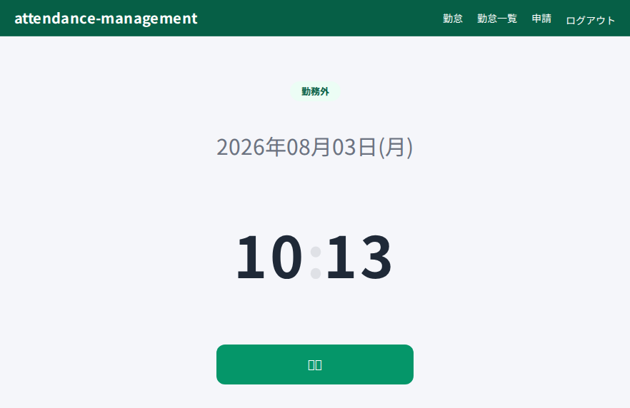
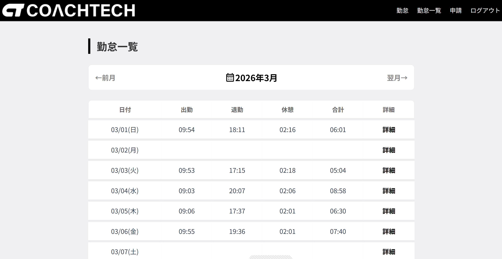
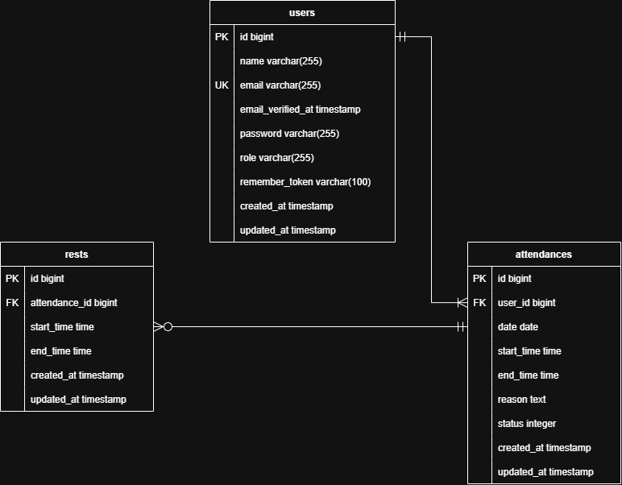

# 勤怠管理アプリ


勤怠管理アプリです。

## スクリーンショット

|             勤怠登録画面              |           勤怠一覧画面            |
| :-----------------------------------: | :-------------------------------: |
|  |  |

## 機能一覧

### 利用者向け機能

- **ユーザー認証**: 新規登録、ログイン、メール認証機能。
- **打刻機能**: 出勤、退勤、休憩開始、休憩終了をリアルタイムに記録。
- **勤務履歴閲覧**: 過去の勤務データ、休憩時間、実働時間を一覧表示。
- **修正申請**: 勤務データの修正依頼と、管理者への承認申請。

### 管理者向け機能

- **スタッフ管理**: 登録済みスタッフの一覧表示。
- **日別勤怠確認**: 特定の日付の全スタッフの勤怠状況を一覧表示。
- **申請承認**: スタッフからの修正依頼に対する承認。

本プロジェクトはDockerコンテナ上で動作します。

## 環境構築

```bash
git clone https://github.com/orangecraftsparkling-3280/attendance-management.git
cd attendance-management
docker compose up -d --build
cp src/.env.example src/.env
docker compose exec php composer install
docker compose exec php php artisan key:generate
docker compose exec php php artisan storage:link
```

MySQLコンテナの起動完了までに時間がかかることがあります。
数秒待ってから下記のコマンドを実行してください。

```bash
docker compose exec php php artisan migrate:fresh --seed
```

## テストの実行と品質担保

本プロジェクトでは、PHPUnit を用いた自動テストを導入し、全 26 項目のテストを通過しています。

### テストの実行方法

コンテナ内で以下のコマンドを実行してください。

```bash
docker compose exec php php artisan test
```

## 🔐 テスト用アカウント

一般ユーザーには各15件ずつの勤務データ（休憩含む）が自動生成されます。

> [!TIP]
> テストデータは各 Factory および `UserSeeder` によって定義されています。
> 実行ごとにランダムな休憩時間や勤務時間が生成され、実際の利用シーンに近い状態を再現しています。

### ログイン情報

| 権限              | メールアドレス      | パスワード | 備考                 |
| :---------------- | :------------------ | :--------- | :------------------- |
| **管理者**        | `admin@example.com` | `password` | 管理画面へのアクセス |
| **一般ユーザー1** | `user1@example.com` | `password` | user1                |
| **一般ユーザー2** | `user2@example.com` | `password` | user2                |
| **一般ユーザー3** | `user3@example.com` | `password` | user3                |

### ログインURL

- **一般ユーザー**: [http://localhost/login](http://localhost/login)
- **管理者用**: [http://localhost/admin/login](http://localhost/admin/login)

## 実行環境

### Docker環境

Docker 20.x 以上
Docker Compose 1.29.x 以上
PHP 8.x
Laravel 10.x
MySQL 8.0.26
Nginx 1.21.1

### ホストOS

macOS / Windows / Linux（Dockerが動作する環境）

### 推奨ブラウザ

Chrome / Firefox / Edge（最新バージョン）

### 接続先一覧

Webサイト: http://localhost

管理者サイト http://localhost/admin/login

DB管理: http://localhost:8080

メール承認テスト(MailHog): http://localhost:8025

・会員登録時のメール認証などがこのツールに届きます。

## 🛠 データベース設計

<details>
<summary> 📘 <code>users</code></summary>
<br>

| カラム名              | 型              | PK  | UK  | NN  | 備考 |
| :-------------------- | :-------------- | :-: | :-: | :-: | :--- |
| **id**                | unsigned bigint |  ○  |     |  ○  |      |
| **name**              | string          |     |     |  ○  |      |
| **email**             | string          |     |  ○  |  ○  |      |
| **password**          | string          |     |     |  ○  |      |
| **role**              | string          |     |     |  ○  |      |
| **remember_token**    | varchar(100)    |     |     |     |      |
| **email_verified_at** | timestamp       |     |     |     |      |
| **created_at**        | timestamp       |     |     |     |      |
| **updated_at**        | timestamp       |     |     |     |      |

</details>

<details>
<summary> 📗 <code>attendances</code></summary>
<br>

| カラム名       | 型              | PK  | UK  | NN  | 備考 |
| :------------- | :-------------- | :-: | :-: | :-: | :--- |
| **id**         | unsigned bigint |  ○  |     |  ○  |      |
| **user_id**    | unsigned bigint |     |     |  ○  |      |
| **date**       | date            |     |     |  ○  |      |
| **start_time** | time            |     |     |     |      |
| **end_time**   | time            |     |     |     |      |
| **reason**     | text            |     |     |     |      |
| **status**     | integer         |     |     |  ○  |      |
| **created_at** | timestamp       |     |     |     |      |
| **updated_at** | timestamp       |     |     |     |      |

</details>

<details>
<summary> 📙 <code>rests</code></summary>
<br>

| カラム名          | 型              | PK  | UK  | NN  | 備考 |
| :---------------- | :-------------- | :-: | :-: | :-: | :--- |
| **id**            | unsigned bigint |  ○  |     |  ○  |      |
| **attendance_id** | unsigned bigint |     |     |  ○  |      |
| **start_time**    | time            |     |     |  ○  |      |
| **end_time**      | time            |     |     |     |      |
| **created_at**    | timestamp       |     |     |     |      |
| **updated_at**    | timestamp       |     |     |     |      |

</details>

## ER図

<details>
<summary>ER図を表示する</summary>



</details>

## 作成者

- 作成者: [kazuyuki asari]
- GitHub: [https://github.com/orangecraftsparkling-3280](https://github.com/orangecraftsparkling-3280)
